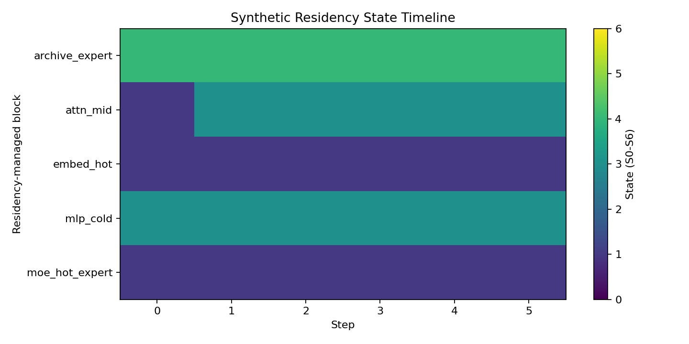
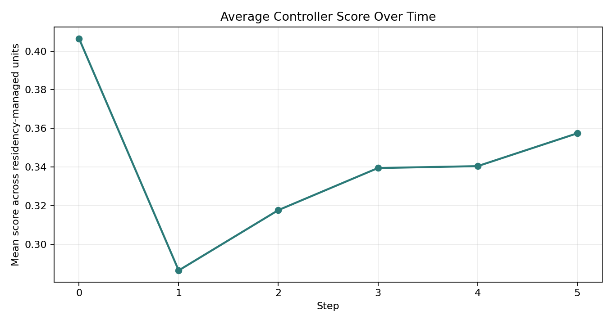
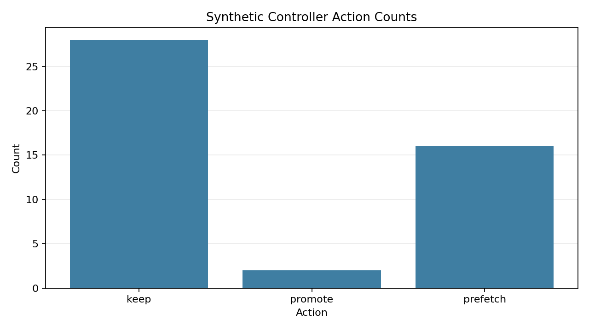
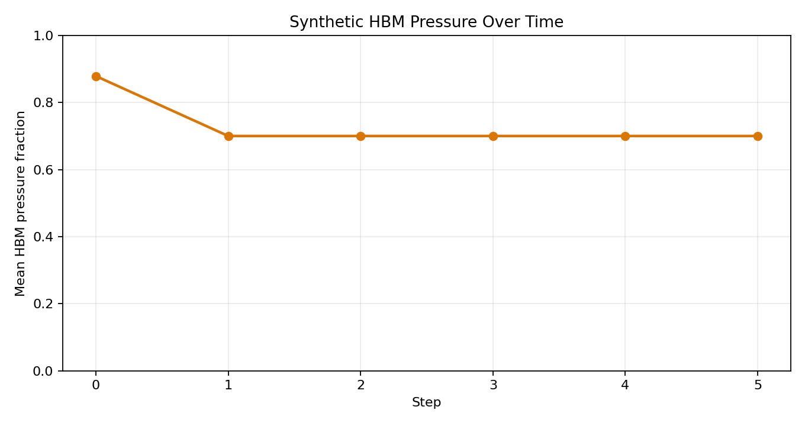

# vOrchestrate

> Dynamic weight residency orchestration for LLM inference across HBM, DRAM, and NVMe.

Status: Early prototype / research implementation

[](LICENSE)
[](pyproject.toml)
[](#current-status)
[](https://github.com/manishklach/vorchestrate/actions/workflows/ci.yml)
[]()

vOrchestrate is an early systems prototype for dynamic multi-tier weight residency orchestration. The current repository focuses on controller logic: metadata tracking, scoring, guardrail-aware demotion, state transitions, controller simulation, and the integration surfaces needed for richer runtime experiments.

## Current Status

This repository is best read as a reference implementation of the controller architecture.

- it demonstrates controller structure, residency metadata tracking, scoring logic, guardrails, state transitions, and orchestration scaffolding
- it includes a controller simulation path that exercises the policy on synthetic block descriptors rather than implying broad real-model support
- it now includes one narrow real-model validation path for a small decoder-only model so the controller can be inspected on a real forward pass
- large-model validation and reproducible benchmarks are still in progress
- the runnable examples are illustrative prototype paths, not end-to-end proof of production readiness

The long-term direction is broader than the current scaffold: tighter adapter integration, real movement backends, and validated studies of memory, latency, and quality tradeoffs on real models.

## Problem

For many large-model inference setups, HBM is the tightest memory tier in the system. A static residency policy can waste scarce device memory by keeping blocks resident long after their useful window has passed, while other blocks are fetched too late or demoted too aggressively.

The usual alternatives each come with tradeoffs:

- static quantization can be effective, but it treats many blocks uniformly even when quality sensitivity is uneven
- naive offload can extend capacity, but often at a significant transfer or latency cost
- overprovisioned GPU memory simplifies deployment, but is not always available or cost-efficient

vOrchestrate explores a controller-centric alternative: score blocks continuously, keep the valuable ones near compute, and stage colder ones to the right tier at the right time. That matters because memory hierarchy pressure is becoming a first-order systems constraint in large-model serving.

## Controller Model

The current codebase centers on a controller model with:

- per-block metadata
- a composite residency score
- a seven-state residency ladder
- guardrail-aware transitions
- an orchestration or prefetch scaffold

The scoring model currently implemented in the prototype is:

```text
R(b) = (w1·ρ(b) + w2·λ(b) + w3·κ(b) + w4·ψ(b))
       ÷ (α·δ(b) + β·τ(b))
```

Where:

- `ρ(b)` is reuse score
- `λ(b)` is routing likelihood
- `κ(b)` is criticality
- `ψ(b)` is sensitivity
- `δ(b)` is decompression cost
- `τ(b)` is transfer cost

The current code captures the policy shape, transitions, and control-plane logic. It is intended as a foundation for richer movement backends, stronger instrumentation, adapter-backed experiments, and eventually validated memory and quality tradeoff studies.

For a concise overview of the public surface that exists today, see [docs/api.md](docs/api.md).

The controller currently reasons about a seven-state model:

| State | Meaning |
|-------|---------|
| `S0` | full precision in HBM |
| `S1` | low-bit in HBM |
| `S2` | compressed in HBM |
| `S3` | staged in host DRAM |
| `S4` | staged on NVMe |
| `S5` | in-flight transfer |
| `S6` | recomputable or derived fallback |

## What The Repo Implements Today

| Capability | Status | Notes |
|------------|--------|-------|
| Block metadata / registry | Present | Tracks residency-related metadata per unit |
| Scoring engine | Present | Computes residency priority from policy inputs |
| State machine | Present | Models transitions across `S0`–`S6` |
| Guardrail logic | Present | Protects sensitive blocks from aggressive demotion |
| Scheduler / orchestration scaffold | Present | Early controller path exists |
| Synthetic controller simulation | Present | Deterministic simulation uses structured synthetic block descriptors |
| Trace writer | Present | JSON and CSV trace output for simulation runs |
| Lightweight metrics container | Present | Counts promotions, demotions, prefetches, stages, and vetoes |
| Narrow real-model validation path | Present | Small decoder-only benchmark path for `distilgpt2`-style validation |
| Integration surface | Partial / illustrative | Adapter shape exists and the Hugging Face wrapper remains exploratory |
| Reproducible benchmark suite | Planned | Methodology and scaffolding are in progress |

## What Is Not Complete Yet

Some important pieces are still ahead of the current implementation:

- there is no published large-model benchmark suite yet
- there is no broad proof of quality parity yet
- there is no universal Hugging Face support claim
- the current real-model benchmark is intentionally narrow and limited to a small decoder-only validation path
- current examples are intentionally small and inspectable
- the current repository should be read as a serious prototype, not finished production infrastructure

## Quick Start

### Runnable local example

The fastest way to inspect controller behavior today is to run the synthetic trace simulation:

```bash
python examples/simulated_trace.py
```

That path constructs deterministic synthetic block descriptors, runs them through the existing scoring, guardrail, state-machine, and scheduling path, and writes trace artifacts you can inspect directly.

You can also run the smaller toy wrapper example:

```bash
python examples/basic_usage.py
```

To render simple plots from the synthetic trace output:

```bash
python examples/render_trace_report.py
```

For the first narrow real-model validation step:

```bash
pip install -e .[dev,real-bench]
python benchmarks/real_model_benchmark.py --model-name distilgpt2
```

That path runs a real small-model forward pass, records observed runtime metrics, and emits controller-intended actions through the current prototype adapter and registry path.

## Visualizing Controller Behavior

The controller simulation can be rendered into a small visual report. This is a prototype visibility path for synthetic traces, designed to make the policy easier to inspect without implying real-model telemetry or hardware benchmark output.

Run the simulation first, then render the plots:

```bash
python examples/simulated_trace.py
python examples/render_trace_report.py
```

By default this writes:

- synthetic traces under `benchmarks/results/simulated_trace/`
- plots under `examples/output/simulated_trace_report/`

### Sample output from synthetic simulation

The following plots are generated from the deterministic synthetic trace included in the repository. They show controller behavior on structured block descriptors — not real-model telemetry.

**State timeline** — how residency-managed units move across `S0`–`S6` over simulation steps:



**Score evolution** — average composite controller score over time:



**Action distribution** — how often the controller issued each action type:



**HBM pressure** — synthetic memory pressure signal driving controller decisions:



See [docs/visualization.md](docs/visualization.md) for plot meanings, trace assumptions, and interpretation limits.


### Target integration shape

The repository also includes an illustrative integration shape for transformer-style model wrapping:

```python
from transformers import AutoModelForCausalLM
from vorchestrate import VOrchestrate

model = AutoModelForCausalLM.from_pretrained("gpt2")
model = VOrchestrate(
    model,
    hbm_budget_gb=4.0,
    psi_threshold=0.7,
    tick_every_n_layers=4,
    enable_prefetch=True,
)
```

This should be read as a target integration surface, not as a broadly validated claim of support for arbitrary model stacks.

## Architecture

```text
Inference Engine
    -> Telemetry / Registry
    -> Scoring Engine
    -> Guardrail
    -> State Machine
    -> Scheduler / Prefetch
    -> HBM / DRAM / NVMe tiers
```

See [docs/architecture.md](docs/architecture.md) for the fuller controller explanation and the Mermaid architecture diagram.

## Repository Layout

```text
vorchestrate/core          core controller logic: registry, scorer, metrics, guardrail, state machine, scheduler
vorchestrate/integrations  integration scaffolding and minimal future adapter surface
vorchestrate/utils         trace utilities and synthetic controller simulation helpers
examples                   runnable prototype examples and illustrative integration paths
benchmarks                 benchmark scaffold and output directory for synthetic runs
docs                       architecture, benchmark plan, roadmap, limitations, design principles
tests                      pragmatic pytest coverage for core logic and prototype utilities
```

## Benchmarks

The benchmark path is being built in stages, with synthetic traces first and a narrow real-model validation path now available for a small decoder-only model.

See [docs/benchmark_plan.md](docs/benchmark_plan.md) for the methodology and
[docs/visualization.md](docs/visualization.md) for the synthetic reporting path.
See [docs/real_model_validation.md](docs/real_model_validation.md) for the real-model validation scope and exact benchmark command.

| Work Item | Status | Notes |
|-----------|--------|-------|
| Synthetic controller traces | Present | Deterministic simulation path is available |
| Benchmark stub harness | Present | Writes synthetic artifacts under `benchmarks/results/` |
| Small-model real integration benchmark | Present | Narrow `distilgpt2`-style decoder-only validation path |
| Larger-model memory and quality study | Planned | Not yet published |
| Reproducible benchmark report | TBD | Depends on instrumentation and validation work |

## Roadmap

Immediate roadmap items:

- controller trace simulation
- metrics instrumentation
- benchmark harness
- adapter experiments
- richer documentation

The phased roadmap is described in [docs/roadmap.md](docs/roadmap.md).

## Project Trajectory

Today the repository exposes controller logic, simulation, traces, a narrow real-model benchmark, and an early benchmark scaffold. The next step is broader adapter-backed experimentation and stronger instrumentation. The longer arc is toward validated runtime studies on real models, with more capable movement backends and clearer measurements of HBM pressure, latency, and quality tradeoffs.

## Contributing

Contributions are especially welcome around:

- policy experiments
- instrumentation
- adapters
- traces
- benchmarks

Please read [CONTRIBUTING.md](CONTRIBUTING.md) first.

## Patent

This repository is related to methods described in Indian Patent Application **IN 202641039064** — *System and Method for Predictive Multi-Tier Weight Residency and Precision Orchestration for Neural-Network Inference* — filed 29 March 2026.

## Author

**Manish KL**  
ML Systems Engineer · Bangalore, India  
GitHub: [@manishklach](https://github.com/manishklach)  
Email: `manishklach@gmail.com`

## License

Apache 2.0 — see [LICENSE](LICENSE).
