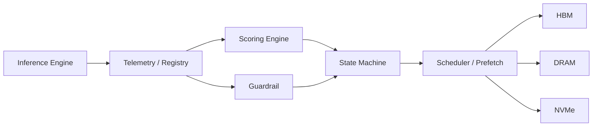

# vOrchestrate Architecture

vOrchestrate is currently best described as a controller-oriented prototype for dynamic weight residency orchestration. The repository focuses on the policy plane: how a system might represent residency-managed units, score them, guard against harmful demotion, and record transition behavior.

## Controller Overview

The prototype consists of a small set of cooperating modules:

- `WeightBlockRegistry`
- `ScoringEngine`
- `AccuracyGuardrail`
- `WeightStateMachine`
- `PrefetchScheduler`
- synthetic trace and metrics tooling

The current implementation is strong on controller structure and testable orchestration logic. It is intentionally lighter on production data movement backends.

## Mermaid Diagram

The diagram below shows the current controller flow and the memory tiers it is designed to reason about.



## Scoring Terms

The prototype uses the following controller score:

```text
R(b) = (w1·ρ(b) + w2·λ(b) + w3·κ(b) + w4·ψ(b))
       ÷ (α·δ(b) + β·τ(b))
```

Where:

- `ρ(b)` is reuse score derived from recent access behavior
- `λ(b)` is routing likelihood for route-dependent or sparse-activation paths
- `κ(b)` is criticality assigned to the residency-managed unit
- `ψ(b)` is sensitivity used by the guardrail
- `δ(b)` is decompression cost
- `τ(b)` is transfer cost

In the current repository, those terms are stored and processed as controller metadata. That means the code can already evaluate policy behavior even when a full backend for moving actual model weights is not yet present.

## State Model

The controller defines seven states:

| State | Meaning | Current role |
|-------|---------|--------------|
| `S0` | Full precision in HBM | Active controller state |
| `S1` | Low-bit in HBM | Active controller state |
| `S2` | Compressed in HBM | Active controller state |
| `S3` | Staged in host DRAM | Active controller state |
| `S4` | Staged on NVMe | Active controller state |
| `S5` | In-flight transfer | Conceptual controller state |
| `S6` | Recomputable or derived fallback | Conceptual controller state |

The current code models all seven states at the policy level. Some of them still need fuller runtime backends before they become more than controller states.

## Lifecycle Of A Residency-Managed Unit

The current scaffold models a residency-managed unit like this:

1. register the unit and attach residency-related metadata
2. update access history and predicted next use
3. recompute its score
4. apply guardrail logic if sensitivity is high
5. choose a target state under current HBM pressure
6. issue a transition or keep decision
7. record queue activity, traces, and counters

This lifecycle is what gives the repository practical value today: it provides a testable policy loop.

## Guardrail

The guardrail is a central safeguard in the prototype. It prevents blocks above a sensitivity threshold from being demoted below low-bit HBM residency.

This is not yet a proof of broad quality preservation. It is a policy mechanism intended to bias the controller toward graceful degradation before quality-sensitive units are pushed too far down the residency ladder.

## Implemented Today

Implemented in the current repo:

- metadata tracking and access-history updates
- scoring and ranking logic
- state-machine transitions
- guardrail veto logic
- async scheduling scaffold
- synthetic simulation, trace writing, and metrics accumulation
- partial integration surfaces and small wrapper paths

## Future Work

Still ahead:

- richer movement backends
- stronger instrumentation on live runs
- reproducible benchmark reports
- small-model validation
- larger-model experiments
- broader adapter work
